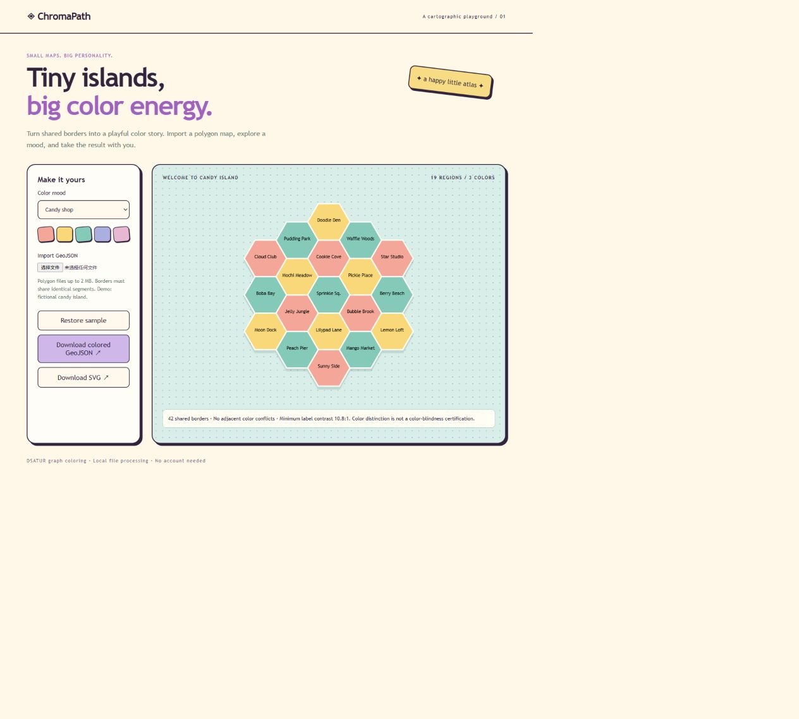

# ChromaPath ◈

**A happy little atlas: playful map palettes, a portable agent skill, and real graph coloring.**



## Try it

Requires Node.js 22 or later. No dependencies to install.

```sh
npm start
# Open http://127.0.0.1:3201
npm test
```

Explore the original **Candy Island** fixture, switch between Candy Shop, Pickle Picnic and Bubble Bath, or import a small GeoJSON Polygon FeatureCollection. Export a colored GeoJSON or a standalone SVG.

## Use the skill

The self-contained skill lives in [`skills/map-palette`](skills/map-palette). Copy that folder to your agent's supported skill directory. It includes instructions and a deterministic CLI; Node.js 22+ is the only runtime requirement.

Example request:

> Give this neighborhood map a candy-shop palette. Keep neighboring regions different and export a colored GeoJSON. Tell me what topology assumptions you made.

Direct CLI:

```sh
node skills/map-palette/scripts/color-map.mjs --sample candy.geojson sorbet
node skills/map-palette/scripts/color-map.mjs input.geojson colored.geojson ocean
```

The CLI refuses to overwrite an existing output file. Available palette identifiers: `sorbet`, `forest`, `ocean`.

## How it works

1. Validate a small Polygon FeatureCollection.
2. Index undirected polygon segments to construct shared-border adjacency.
3. Run deterministic DSATUR greedy coloring: select highest saturation, then highest degree, then stable feature order.
4. Assign palette colors and choose black/white label text based on contrast.
5. Preserve geometry and properties in exported GeoJSON, adding simplestyle fill/stroke attributes.

The sample has 19 regions and 42 shared borders. Tests check edge counts, neighboring-color invariants, complete graphs, isolated nodes, malformed inputs, contrast reference values, server behavior and CLI output protection. A synchronization test ensures the browser and portable skill use identical algorithm code.

## Boundaries that matter

- Adjacency uses **identical shared segments**. Point contacts do not count. Differently segmented boundaries require preprocessing. This is not a general GIS topology engine.
- Supports Polygon only: no MultiPolygon, reprojection, overlap repair, antimeridian handling or geographic basemap.
- The viewer fits coordinates linearly. Its demo uses original synthetic planar coordinates, not real places.
- DSATUR is a heuristic, not an optimal coloring solver. Palette overflow is reported rather than cycling into conflicts.
- Text contrast is measured; color-blind distinguishability is not certified. Vertex-mean labels may fall outside concave regions.
- Import limit: 2 MB, 250 regions, 30,000 positions. Files stay in the browser.

Deploy `public/` on any static host. The optional Pages workflow is manually triggered after Pages is configured to use GitHub Actions.

## 中文说明

趣味地图配色 Skill + 交互演示。支持糖果、森林和泡泡浴三种主题，以真实图着色算法区分相邻区域，并导出 SVG/GeoJSON。Skill 可独立复制使用，无须安装第三方依赖。

可用于展示：算法实现、GeoJSON 数据处理、自动化工具封装、测试和视觉交互。项目由 AI 辅助开发；面试时可讲解相邻关系如何计算、DSATUR 的取舍，以及为什么文字对比度不等同于色盲友好。

License: MIT. The fictional sample geometry and interface are original to this project.
